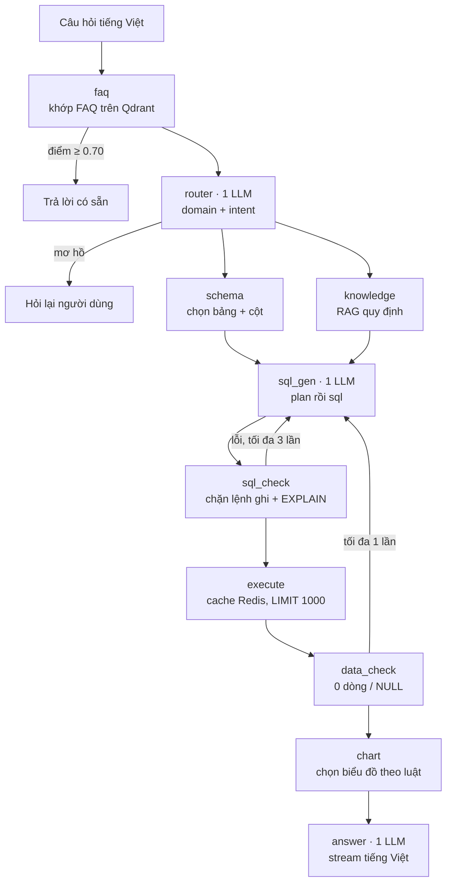

# Tổng quan bài toán Text-to-SQL (nlsql) và nghiên cứu liên quan

Sep 24, 2026 · @Đặng Quang Dũng

## Tóm tắt

nlsql giải bài toán Text-to-SQL tiếng Việt trên hai CSDL của trường bằng một pipeline LangGraph tốn 3 lượt gọi LLM mỗi câu, và hiện đạt 12/12 trên benchmark nội bộ. Kiến trúc đã đúng hướng, nhưng nghiên cứu cho thấy độ chính xác thật trên schema cỡ này có thể thấp hơn nhiều so với con số đó.

- **Bài toán khó ở ngữ nghĩa, không ở cú pháp.** Trên benchmark doanh nghiệp giống nlsql, LLM mạnh chỉ đạt 11–21%, trong khi đạt khoảng 91% trên Spider 1.0.
- **Tiếng Việt thiếu dữ liệu.** Chỉ có ViText2SQL từ 2020 và phần tiếng Việt của MultiSpider. Chưa có benchmark nào dùng tên cột không dấu hay ClickHouse.
- **Ngành hội tụ về semantic layer và truy vấn đã xác minh.** Looker báo giảm lỗi tới hai phần ba. Snowflake đạt hơn 90% so với 51% của GPT-4o dùng một prompt.
- **nlsql còn thiếu bốn thứ chính:** benchmark đủ lớn, phân quyền ở tầng DB, semantic layer và truy xuất giá trị.
- **Một rủi ro mới:** upstream của wren-ui đã ngừng hỗ trợ và không còn phát hành bản vá bảo mật.

## Định nghĩa bài toán

Bài toán là biến một câu hỏi tiếng Việt thành câu SQL chạy được trên đúng cơ sở dữ liệu, rồi trình bày kết quả thành văn bản, bảng hoặc biểu đồ. Trong giới nghiên cứu, bài toán này gọi là Text-to-SQL hay NL2SQL, còn phần trình bày biểu đồ gọi là NL2VIS hay text-to-dashboard.

**Đầu vào** gồm bốn thứ:

- Câu hỏi q của người dùng, viết bằng tiếng Việt tự nhiên, có thể viết tắt hoặc thiếu dấu.
- Lịch sử hội thoại H, vì câu sau thường dựa vào câu trước.
- Tập cơ sở dữ liệu D₁…Dₙ. Mỗi cái có schema S gồm bảng, cột, khóa ngoại và mô tả tiếng Việt.
- Tri thức nghiệp vụ K, ví dụ định nghĩa "sinh viên xuất sắc" hay "lượt học".

**Đầu ra** gồm domain được chọn, câu SQL theo đúng dialect của engine, kết quả thực thi, câu trả lời tiếng Việt và cấu hình biểu đồ.

```latex
d^{*} = \arg\max_{d} P(d \mid q, H) \qquad y^{*} = \arg\max_{y} P(y \mid q, H, S_{d^{*}}, K)
\text{đúng} \iff \mathrm{exec}(y^{*}, D_{d^{*}}) = \mathrm{exec}(y_{\text{gold}}, D_{d^{*}})
```

Tiêu chí đúng phổ biến nhất là execution accuracy: kết quả chạy câu SQL sinh ra trùng với kết quả chạy câu SQL chuẩn. Hai câu SQL khác chữ vẫn được tính đúng nếu cho cùng kết quả.

| Biến thể | Ý nghĩa | Trong nlsql |
| --- | --- | --- |
| Một CSDL | Người dùng đã biết hỏi DB nào | Endpoint riêng cho qldt và tcns |
| Nhiều CSDL (routing) | Hệ thống tự chọn DB | Node router chọn qldt hoặc tcns ở endpoint chung |
| Join chéo nhiều CSDL | Một câu cần dữ liệu từ hai DB | Chưa làm |
| Hội thoại nhiều lượt | Câu hỏi phụ thuộc lượt trước | Có truyền lịch sử chat |
| Mơ hồ hoặc ngoài phạm vi | Cần hỏi lại hoặc từ chối | Intent ambiguous và out\_of\_scope |
| Hỏi quy định | Trả lời từ văn bản, không cần SQL | Intent knowledge\_query |
| Text-to-dashboard | Chọn biểu đồ phù hợp từ kết quả | Node chart |

Phạm vi dự án là **chỉ đọc**. Lệnh ghi bị chặn bằng cờ ALLOW\_WRITE\_SQL=false và regex ở bước kiểm tra SQL.

Hai CSDL nghiệp vụ hiện có là Quản lý đào tạo (qldt: sinh viên, ngành, học phần, điểm, tốt nghiệp, học bổng) và Tổ chức cán bộ nhân sự (tcns: cán bộ, đơn vị, hợp đồng, lương).

## Hệ thống nlsql hiện tại

nlsql là một pipeline đa tác nhân trên LangGraph gồm 13 node, tốn 3 lượt gọi LLM cho một câu hỏi dữ liệu thông thường. Sơ đồ dưới đây lấy từ code sau đợt gọn pipeline ngày 2026-09-22.



Hai vòng tự sửa bắt hai lớp lỗi khác nhau. Vòng sql\_check bắt lỗi cú pháp và sai tên cột, còn vòng data\_check bắt kết quả rỗng hoặc NULL. Cả hai đều không bắt được lỗi chọn nhầm bảng khi kết quả vẫn trông hợp lệ.

| Thành phần | Công nghệ |
| --- | --- |
| Điều phối | LangGraph StateGraph |
| LLM | OpenAI. Mẫu cấu hình dùng gpt-5.4-mini, riêng sinh SQL dùng gpt-5.4 |
| Embedding và vector store | text-embedding-3-small, Qdrant |
| CSDL nghiệp vụ | ClickHouse hoặc PostgreSQL, chọn theo từng domain |
| Cache | Redis |
| API | FastAPI, stream token qua SSE |
| Giao diện | wren-ui, fork từ WrenAI (Next.js) |

**Schema linking hai tầng.** Mỗi bảng và mỗi cột là một điểm riêng trên Qdrant. Điểm xếp hạng kết hợp 0.4 · bảng + 0.3 · cột tốt nhất + 0.2 · khớp từ vựng bỏ dấu + 0.1 · prior theo số dòng. Sau đó LLM chọn từ tối đa 20 ứng viên.

**Tri thức nghiệp vụ** đến từ hai nguồn. Một là bảng quy định đồng bộ từ Google Sheet sang Qdrant. Hai là khối quy tắc TABLE\_RULES viết cứng trong cấu hình, ví dụ "lượt học" là đếm bảng DiemHocPhan.

| Chỉ số (domain qldt) | Trước đợt 3–4 | Sau đợt 4 (2026-09-22) |
| --- | --- | --- |
| Execution accuracy, 12 câu nội bộ | 11/12 | 12/12, hai lần chạy |
| Recall@5 bảng đúng | 6/12 | 10/12 |
| Lượt gọi LLM mỗi câu | 6–7 | 3 |
| Độ trễ trung bình (giây) | 13–18 | 7,1 |

Quy mô schema qldt là 253 bảng và 4.266 cột, kèm 502 khóa ngoại lấy từ file Excel mô tả vì ClickHouse không lưu khóa ngoại.

**Điểm yếu đã biết**, theo tài liệu trạng thái của dự án:

- Domain tcns có 0 bảng trong DB, trong khi Qdrant vẫn giữ 161 điểm schema cũ. Câu hỏi nhân sự được route đúng rồi thất bại.
- LLM không biết giá trị thật của cột enum. Ví dụ nó viết 'DANG\_HOC' trong khi giá trị thật là 'Đang học'.
- Benchmark chỉ có 12 câu và chưa câu nào kích hoạt vòng sửa lỗi, nên chưa đo được giá trị của hai vòng này.
- Kế hoạch phân quyền DB cho agent (role chỉ đọc, view che dữ liệu cá nhân) chưa được thi hành.

## Thách thức chính

Khó khăn lớn nhất không nằm ở cú pháp SQL. Nó nằm ở việc hiểu đúng schema lớn, nghĩa nghiệp vụ và giá trị thật trong dữ liệu. Cả nghiên cứu lẫn số liệu đo của nlsql đều cho thấy điều này.

| Thách thức | Bằng chứng từ nghiên cứu | Biểu hiện trong nlsql |
| --- | --- | --- |
| Schema linking trên schema lớn | [Spider 2.0](https://arxiv.org/abs/2411.07763): o1-preview đạt 21,3%, so với 91,2% trên Spider 1.0. [BEAVER](https://arxiv.org/abs/2409.02038), gồm cả một kho dữ liệu đại học 97 bảng: cấu hình tốt nhất chỉ đạt 11,4%. | 253 bảng, 4.266 cột. Trước đợt 4, bảng đúng chỉ nằm trong top 5 ở 6/12 câu. |
| Ngữ nghĩa nghiệp vụ | [BIRD](https://arxiv.org/abs/2305.03111) phải kèm "evidence" vì câu hỏi thật cần tri thức ngoài schema. [KaggleDBQA](https://aclanthology.org/2021.acl-long.176/): tài liệu mô tả CSDL tăng hiệu năng hơn 13,2%, tức gấp đôi. | "Lượt học" chỉ đúng khi có quy tắc đếm DiemHocPhan. Trước đó hai lần chạy chọn hai bảng khác nhau dù temperature bằng 0. |
| Khớp giá trị trong dữ liệu | [CHESS](https://arxiv.org/abs/2405.16755) dùng chỉ mục LSH trên giá trị cột. [UniQL](https://arxiv.org/abs/2606.08018): 46,98% lỗi trên ClickHouse là sai giá trị hoặc bộ lọc. | Few-shot đầu tiên viết 'DANG\_HOC' thay cho 'Đang học'. Câu SQL qua được EXPLAIN nhưng trả 0 dòng. |
| Tiếng Việt và cách đặt tên | [MultiSpider](https://arxiv.org/abs/2212.13492): ngôn ngữ ngoài tiếng Anh giảm trung bình 6,1%. [MultiSpider 2.0](https://arxiv.org/abs/2509.24405): trên schema doanh nghiệp, o1 chỉ đạt khoảng 4%. [SNAILS](https://adalabucsd.github.io/papers/TR_2025_SNAILS.pdf): tên càng khó đọc, schema linking càng kém. | Câu hỏi có dấu, không dấu hoặc viết tắt như ĐTBTL, CTĐT. Tên bảng và cột là tiếng Việt không dấu kiểu SinhVien, MaNganh. |
| Khác biệt dialect | [BIRD Mini-Dev](https://github.com/bird-bench/mini_dev): GPT-4 đạt 47,8% trên SQLite nhưng 35,8% trên PostgreSQL. [UniQL](https://arxiv.org/abs/2606.08018): Claude-4.5-Sonnet đạt 56,84% trên ClickHouse, 59,84% trên SQLite. | Chia hai số nguyên trong ClickHouse cắt phần thập phân. SQL vẫn chạy nhưng ra số sai. |
| Mơ hồ và câu không trả lời được | [AMBROSIA](https://arxiv.org/abs/2406.19073): recall trên câu mơ hồ chỉ 30,7%. [BIRD-Interact](https://arxiv.org/abs/2510.05318): GPT-5 hoàn thành 8,67% nhiệm vụ ở chế độ hội thoại. | "Sinh viên giỏi", "năm nay", học lực theo kỳ hay tích lũy. Chưa có cơ chế từ chối khi thiếu dữ liệu. |
| Lỗi âm thầm và giới hạn tự sửa | [BIRD-CRITIC](https://arxiv.org/abs/2506.18951): o3-mini sửa đúng 38,87% lỗi SQL PostgreSQL, chuyên gia đạt 78,87%. | data\_check không bắt được câu SQL chọn nhầm bảng mà vẫn trả kết quả trông hợp lệ. |
| Bảo mật và phân quyền | [P2SQL](https://arxiv.org/abs/2308.01990): prompt-to-SQL injection thành công trên mọi LLM sinh được SQL hợp lệ. [Benchmark RBAC](https://arxiv.org/abs/2607.22115): tỉ lệ vi phạm quyền từ 2,11% đến 50,41% trên Spider. | Khảo sát nội bộ ngày 2026-09-11: API chưa có xác thực, agent chạy bằng tài khoản quản trị, chặn lệnh ghi chỉ bằng regex. |
| Đánh giá đáng tin | [Annotation errors](https://arxiv.org/abs/2601.08778): 52,8% câu BIRD Mini-Dev và 62,8% câu Spider2-Snow có lỗi nhãn. | Benchmark nội bộ chỉ 12 câu, chưa câu nào kích hoạt vòng sửa lỗi. |

Ba thách thức đầu quyết định độ chính xác. Thách thức bảo mật quyết định hệ thống có được mở cho người dùng thật hay không.

## Bộ dữ liệu và benchmark

Điểm trên benchmark học thuật đã gần bão hòa, còn trên benchmark doanh nghiệp giống nlsql thì vẫn thấp. Top BIRD đạt 82,39%, nhưng cùng thời kỳ cấu hình tốt nhất trên BEAVER chỉ đạt 11,4%. Số liệu leaderboard lấy ngày 2026-09-24.

| Benchmark | Nhóm | Quy mô và đặc điểm | Kết quả nổi bật |
| --- | --- | --- | --- |
| [WikiSQL](https://arxiv.org/abs/1709.00103) (2017) | Thế hệ 1 | 80.654 câu, mỗi câu chỉ một bảng | Seq2SQL đạt 59,4% EX |
| [Spider 1.0](https://yale-lily.github.io/spider) (2018) | Thế hệ 1 | 10.181 câu, 200 DB, cross-domain | Top 91,2% EX (MiniSeek). Ngừng nhận bài từ 02/2024 |
| [BIRD](https://bird-bench.github.io/) (2023) | Thế hệ 2 | 12.751 câu, 95 DB nặng 33,4 GB, dữ liệu bẩn, cần tri thức ngoài | Top 82,39% EX (DataGallery-Text2SQL, 09/2026). GPT-5.5 dùng trần đạt 72,55%. Người đạt 92,96% |
| [BIRD Mini-Dev](https://github.com/bird-bench/mini_dev) (2024) | Thế hệ 2 | 500 câu chạy trên SQLite, MySQL, PostgreSQL | Top 70,20% trên SQLite và 65,80% trên PostgreSQL |
| [Spider 2.0](https://spider2-sql.github.io/) (2024) | Thế hệ 3 | 632 tác vụ doanh nghiệp, DB trên 1.000 cột, BigQuery và Snowflake | Bản Lite đa dialect: 76,23. Bản Snow: 96,70. Cả hai đều là agent; baseline cuối 2024 khoảng 23 |
| [BEAVER](https://arxiv.org/abs/2409.02038) (2024, bản 2026) | Thế hệ 3 | 9.128 câu từ query log thật, 812 bảng, có kho dữ liệu đại học | Tốt nhất 11,4%. Lên 30,1% khi có gợi ý oracle |
| [LiveSQLBench](https://github.com/bird-bench/livesqlbench) (2025) | Thế hệ 3 | PostgreSQL, khoảng 1.000 cột, kho quy định nghiệp vụ thay đổi theo phiên bản | Top 48,00% (DIA, 03/2026) |
| [BIRD-Interact](https://arxiv.org/abs/2510.05318) (2025) | Thế hệ 3 | 600 tác vụ hội thoại có mô phỏng người dùng | GPT-5 đạt 8,67% ở chế độ hội thoại, 17,00% ở chế độ agent |
| [BIRD-CRITIC](https://arxiv.org/abs/2506.18951) (2025) | Thế hệ 3 | 530 lỗi SQL PostgreSQL lấy từ issue thật | o3-mini sửa đúng 38,87%. Chuyên gia đạt 78,87% |
| [CoSQL](https://yale-lily.github.io/cosql) (2019) | Hội thoại | 3.000 hội thoại, hơn 30.000 lượt | Top 58,3 question match, leaderboard dừng từ 2022 |
| [AMBROSIA](https://arxiv.org/abs/2406.19073) (2024) | Mơ hồ | Câu mơ hồ về phạm vi, gắn kết, độ mơ hồ từ | Recall 30,7% trên câu mơ hồ, so với 65,5% trên câu rõ ràng |
| [UniQL](https://arxiv.org/abs/2606.08018) (2026) | Đa dialect | 1.534 câu trên 16 hệ, có ClickHouse | Claude-4.5-Sonnet: ClickHouse 56,84%, PostgreSQL 54,95% |
| [ViText2SQL](https://aclanthology.org/2020.findings-emnlp.364/) (2020) | Tiếng Việt | 9.691 câu dịch tay từ Spider, schema dịch có dấu | 53,2% exact match (IRNet + PhoBERT). Tách từ tăng khoảng 5 điểm |
| [MultiSpider](https://arxiv.org/abs/2212.13492) (2023) | Đa ngôn ngữ | 7 ngôn ngữ, có tiếng Việt | Ngôn ngữ ngoài tiếng Anh giảm trung bình 6,1% |
| [MultiSpider 2.0](https://arxiv.org/abs/2509.24405) (2025) | Đa ngôn ngữ | 5.056 câu, 8 ngôn ngữ có tiếng Việt, schema doanh nghiệp | o1 và DeepSeek-R1 khoảng 4% EX. Agent COLA: tiếng Việt 12,49%, tiếng Anh 15,92% |

Cần đọc leaderboard thận trọng. Một nghiên cứu năm 2026 ước tính 52,8% câu của BIRD Mini-Dev và 62,8% câu của Spider2-Snow có lỗi nhãn. Khi chấm lại, thứ hạng dịch tới 9 bậc ([nguồn](https://arxiv.org/abs/2601.08778)).

Chưa có benchmark công khai nào kết hợp tiếng Việt, tên cột không dấu kiểu CamelCase và ClickHouse. Vì vậy nlsql phải tự xây benchmark nội bộ, và có thể dùng phần tiếng Việt của MultiSpider 2.0 cùng phần ClickHouse của UniQL để kiểm thử bổ sung.

## Các hướng tiếp cận và state of the art

SOTA hiện nay là pipeline đa tác nhân sinh nhiều câu SQL ứng viên rồi chọn lọc, thường kết hợp model đã huấn luyện RL với phần thưởng dựa trên kết quả thực thi. nlsql đã có phần lớn các khối chuẩn, nhưng còn thiếu truy xuất giá trị và bước sinh nhiều ứng viên.

Lĩnh vực đi qua bốn giai đoạn. Đầu tiên là model ngôn ngữ tiền huấn luyện (PLM) được fine-tune. Tiếp theo là prompting LLM, rồi pipeline đa tác nhân. Từ 2025 có thêm fine-tune bằng RL và tăng tính toán lúc suy luận. Hai survey nền tảng là [Liu et al.](https://arxiv.org/abs/2408.05109) và [Hong et al.](https://arxiv.org/abs/2406.08426).

| Phương pháp | Giai đoạn | Ý tưởng cốt lõi | Kết quả | Trong nlsql |
| --- | --- | --- | --- | --- |
| [RAT-SQL](https://arxiv.org/abs/1911.04942) (2020) | PLM | Mã hóa chung câu hỏi và schema, attention biết quan hệ khóa ngoại và khớp tên | Spider 65,6% exact match | Điểm từ vựng bỏ dấu là dạng heuristic của ý tưởng này |
| [RESDSQL](https://arxiv.org/abs/2302.05965) (2023) | PLM | Tách bước xếp hạng bảng và cột khỏi bước sinh SQL | Spider test 79,9% EX | Có tầng xếp hạng bảng và cột, nhưng bằng công thức cố định |
| [DIN-SQL](https://arxiv.org/abs/2304.11015) (2023) | Prompting | Chia bài toán: schema linking, phân loại độ khó, sinh theo loại, tự sửa | Spider 85,3%, BIRD 55,9% | Có dạng rút gọn: plan rồi SQL trong một lượt gọi |
| [DAIL-SQL](https://arxiv.org/abs/2308.15363) (2023) | Prompting | Chọn few-shot theo câu hỏi đã che thực thể và theo độ giống của SQL | Spider test 86,6% | Có 3 ví dụ gần nhất theo embedding, chưa che thực thể |
| [MAC-SQL](https://arxiv.org/abs/2312.11242) (2023) | Đa tác nhân | Ba vai trò: chọn schema, sinh SQL, sửa theo lỗi thực thi | BIRD 59,59%, so với 46,35% của GPT-4 dùng trần | Gần như trùng kiến trúc schema, sql\_gen, sql\_check |
| [CHESS](https://arxiv.org/abs/2405.16755) (2024) | Đa tác nhân | Tìm giá trị trong DB bằng LSH, lọc schema, sinh ứng viên, unit test | BIRD test 71,10% | Chưa có truy xuất giá trị |
| [CHASE-SQL](https://arxiv.org/abs/2410.01943) (2024) | Đa tác nhân | Sinh ứng viên theo ba kiểu chain-of-thought, selector so từng cặp | BIRD test 73,0% | Chỉ sinh một ứng viên |
| [XiYan-SQL](https://arxiv.org/abs/2411.08599) (2024) | Đa tác nhân | Nhiều generator và selector, biểu diễn schema M-Schema kèm kiểu, giá trị mẫu, khóa | BIRD 75,63% | Schema đưa vào prompt đã có mô tả tiếng Việt và khóa ngoại |
| [RSL-SQL](https://arxiv.org/abs/2411.00073) (2024) | Đa tác nhân | Schema linking hai chiều: lọc xuôi, rồi viết SQL nháp để lấy lại cột | Giữ 94% cột cần thiết khi bỏ 83% số cột. BIRD 67,2% | Chỉ có chiều xuôi |
| [ReFoRCE](https://arxiv.org/abs/2502.00675) (2025) | Đa tác nhân | Nén schema theo mẫu tên bảng, khám phá cột bằng truy vấn thử, bỏ phiếu | Spider2-Snow 62,89 khi dùng o3 | Chưa khám phá dữ liệu trước khi viết SQL cuối |
| [DeepEye-SQL](https://arxiv.org/abs/2510.17586) (2025) | Đa tác nhân | Sinh N phiên bản, kiểm tra cú pháp, logic và chất lượng trước khi chạy, chọn theo độ tin cậy | BIRD test 75,07% | Có kiểm tra cú pháp bằng EXPLAIN, chưa kiểm tra logic |
| [Agentar-Scale-SQL](https://arxiv.org/abs/2509.24403) (2025) | Tăng tính toán lúc suy luận | Kết hợp suy luận RL, tinh chỉnh lặp và chọn ứng viên kiểu đấu loại | BIRD test 81,67% | Không áp dụng |
| [OmniSQL](https://arxiv.org/abs/2503.02240) (2025) | Fine-tune | 2,5 triệu mẫu tổng hợp trên hơn 16.000 DB, model 7B–32B | BIRD dev 67,0% (32B, bỏ phiếu) | Dùng API OpenAI, không fine-tune |
| [Arctic-Text2SQL-R1](https://www.snowflake.com/en/blog/engineering/arctic-text2sql-r1-sql-generation-benchmark/) (2025) | RL | GRPO với phần thưởng đơn giản: chạy được và đúng kết quả | BIRD test 71,83% (32B), 68,47% (7B) | Dùng API OpenAI, không fine-tune |
| [Reasoning-SQL](https://arxiv.org/abs/2503.23157) (2025) | RL | GRPO với phần thưởng từng phần, gồm cả schema linking | BIRD test 72,78% với model 14B, chi phí thấp hơn khoảng 93% | Dùng API OpenAI, không fine-tune |
| [Long context](https://arxiv.org/abs/2501.12372) (2025) | Prompting | Đưa gần toàn bộ schema vào context dài thay vì lọc mạnh | BIRD dev 67,41% | Lọc chặt còn tối đa 20 bảng ứng viên |

Hai kết quả đáng chú ý cho nlsql. [AskData của AT&T](https://arxiv.org/abs/2505.19988) đứng thứ ba BIRD với 81,95% chủ yếu nhờ tự động profiling dữ liệu và phân tích query log để sinh metadata. [ReViSQL](https://arxiv.org/abs/2603.20004) cho thấy huấn luyện trên dữ liệu đã kiểm chứng quan trọng ngang kiến trúc pipeline.

Các điểm trên đều đo chủ yếu trên SQLite và tiếng Anh, nên không chuyển thẳng sang nlsql được.

## Hệ thống và sản phẩm trong ngành

Các sản phẩm lớn đều hội tụ về một công thức. LLM không sinh SQL trực tiếp trên bảng thô mà dựa vào semantic layer do người tuyển chọn, cộng với các truy vấn mẫu đã được xác minh và một vòng phản hồi từ người dùng.

| Hệ thống | Loại | Cách làm chính | Số liệu công bố |
| --- | --- | --- | --- |
| [Snowflake Cortex Analyst](https://www.snowflake.com/en/engineering-blog/cortex-analyst-text-to-sql-accuracy-bi/) | Thương mại | Semantic model YAML và kho truy vấn đã xác minh, dùng lại khi câu hỏi khớp | Hơn 90%, so với 51% của GPT-4o dùng một prompt. 150 câu nội bộ, 08/2024 |
| [Databricks AI/BI Genie](https://www.databricks.com/blog/how-build-production-ready-genie-spaces-and-build-trust-along-way) | Thương mại | Kho tri thức gồm từ đồng nghĩa và từ điển giá trị, bộ benchmark riêng, nút yêu cầu duyệt | Ví dụ 13 câu: 0% lên 54% nhờ metadata, 77% nhờ SQL mẫu, 100% nhờ chỉ dẫn nghiệp vụ |
| [Looker (LookML)](https://cloud.google.com/blog/products/business-intelligence/how-lookers-semantic-layer-enhances-gen-ai-trustworthiness) | Thương mại | LLM dùng đối tượng nghiệp vụ định nghĩa sẵn thay vì tên trường thô | Giảm lỗi tới hai phần ba, theo thử nghiệm nội bộ của Google |
| [BigQuery Conversational Analytics](https://cloud.google.com/blog/products/data-analytics/conversational-analytics-in-bigquery-now-ga) | Thương mại | Glossary, truy vấn đã xác minh, embedding giá trị cột, trích dẫn ngữ cảnh, hỏi lại khi mơ hồ | Ra bản chính thức 07/2026 |
| [ThoughtSpot Spotter](https://www.thoughtspot.com/product/agents/spotter) | Thương mại | Dịch câu hỏi sang search token trên semantic layer, rồi sinh SQL tất định | Không công bố độ chính xác |
| [Uber QueryGPT](https://www.uber.com/us/en/blog/query-gpt/) | Nội bộ | Workspace theo domain, agent phân loại intent, người dùng xác nhận bảng, cắt bớt cột | Thời gian viết truy vấn từ 10 xuống 3 phút. Khoảng 300 người dùng mỗi ngày |
| [LinkedIn SQL Bot](https://www.linkedin.com/blog/engineering/ai/practical-text-to-sql-for-data-analytics) | Nội bộ | Knowledge graph kèm truy vấn đã chứng nhận, LLM xếp lại từ 20 xuống 7 bảng, EXPLAIN và tự sửa | Khoảng 95% đánh giá đạt trở lên. Benchmark hơn 130 câu |
| [Pinterest](https://www.zenml.io/llmops-database/text-to-sql-system-with-rag-enhanced-table-selection) | Nội bộ | Chỉ mục vector cho tóm tắt bảng và truy vấn lịch sử | Tỉ lệ chọn trúng bảng từ 40% lên 90% nhờ tài liệu bảng. Tỉ lệ chấp nhận ngay lần đầu từ 20% lên hơn 40% |
| [Swiggy Hermes](https://www.zenml.io/llmops-database/evolution-of-hermes-v3-building-a-conversational-ai-data-analyst) | Nội bộ | Sinh few-shot từ SQL lịch sử, giải thích giả định và điểm tin cậy | Từ 54% lên 93% trên khoảng 100 câu |
| [Grab Data-Arks](https://engineering.grab.com/transforming-the-analytics-landscape-with-RAG-powered-LLM) | Nội bộ | Đóng gói truy vấn hay dùng thành API, LLM chỉ chọn API và tham số | Tiết kiệm 3–4 giờ mỗi báo cáo |
| [WrenAI MDL](https://docs.getwren.ai/oss/concepts/what_is_mdl) | Mã nguồn mở | Semantic layer YAML, engine dịch sang dialect đích, hỗ trợ PostgreSQL và ClickHouse | Không công bố độ chính xác |
| [dbt MetricFlow](https://www.getdbt.com/blog/open-source-metricflow-governed-metrics) | Mã nguồn mở | Biên dịch định nghĩa metric YAML sang SQL theo dialect | 83% câu hỏi trong phạm vi được trả lời đúng |
| [Vanna](https://github.com/vanna-ai/vanna) | Mã nguồn mở | RAG trên DDL, tài liệu và cặp câu hỏi–SQL. Bản 2.0 có phân quyền theo người dùng | Repo đã archive ngày 29/3/2026 |
| [Dataherald](https://github.com/Dataherald/dataherald/tree/main/services/engine) | Mã nguồn mở | Golden SQL, quét cột ít giá trị, điểm tin cậy cho SQL | Ngừng phát triển từ 07/2024 |

Số liệu của vendor đều đo trên benchmark nội bộ nhỏ và bằng tiếng Anh, nên không so sánh chéo được. Số liệu của Pinterest và Swiggy lấy qua bản tóm tắt của ZenML vì bài gốc không mở được.

**Bài học chung** từ các hệ thống trên:

- **Semantic layer là đòn bẩy lớn nhất.** Metadata, SQL mẫu và chỉ dẫn nghiệp vụ tạo ra phần lớn mức tăng, không phải việc đổi model.
- **Truy vấn đã xác minh có người duyệt.** Mỗi mục ghi người duyệt và ngày duyệt, giống node faq và kho few-shot của nlsql nhưng có quy trình quản trị.
- **Tài liệu bảng và cột quyết định bước chọn bảng.** Điều này càng đúng với 253 bảng tên không dấu của qldt.
- **Vòng phản hồi từ người dùng.** Người dùng gắn cờ câu sai, quản trị viên duyệt rồi đưa vào kho mẫu.
- **Đo trong production bằng tỉ lệ chấp nhận ngay lần đầu** và đánh giá của người dùng, bên cạnh execution accuracy.
- **Quyền truy cập đi theo người hỏi.** Agent nội bộ của OpenAI và Vanna 2.0 chỉ cho truy vấn những bảng mà người dùng vốn có quyền.

**Rủi ro với wren-ui.** Tài liệu WrenAI ghi sản phẩm GenBI cũ, tức wren-ui, đã ngừng hỗ trợ và sẽ không có bản vá bảo mật nào nữa ([nguồn](https://docs.getwren.ai/oss/introduction)). nlsql đang dùng fork wren-ui 0.31.3 trên Next.js 14.2.32, nên từ nay nhóm phải tự vá lỗi cho phần giao diện này.

## Phương pháp đánh giá

Execution accuracy là thước đo chính nhưng có sai số đáng kể. nlsql cần thêm đo theo từng node, đo khả năng từ chối đúng lúc, và báo cáo kèm khoảng tin cậy.

| Thước đo | Cách tính | Điểm cần biết | Gợi ý cho nlsql |
| --- | --- | --- | --- |
| Exact Match ([Spider](https://arxiv.org/abs/1809.08887)) | So khớp từng thành phần của câu SQL | Phạt câu SQL đúng nhưng viết khác kiểu | Chỉ dùng khi phân tích lỗi theo thành phần |
| Execution Accuracy ([BIRD](https://arxiv.org/abs/2305.03111)) | So tập kết quả với kết quả của SQL chuẩn | Có thể đúng nhờ trùng hợp. [ETM](https://arxiv.org/abs/2407.07313) đo tỉ lệ dương tính giả tới 23,0% | Giữ làm thước đo chính, đang dùng |
| Test-suite accuracy ([Zhong et al.](https://arxiv.org/abs/2010.02840)) | Chạy trên nhiều bản DB biến thể | Chặt hơn EX. [SynSQL](https://arxiv.org/abs/2604.27261) sinh DB tổng hợp làm điểm 10 hệ thống giảm 3–14% | Chạy trên 2–3 snapshot dữ liệu theo học kỳ |
| Soft-F1 ([BIRD Mini-Dev](https://github.com/bird-bench/mini_dev)), subset match ([Defog](https://github.com/defog-ai/sql-eval)) | Tính F1 theo ô, hoặc cho phép thừa cột | Ít phạt khi SQL thêm cột hiển thị | Hợp với cách sql\_gen hay chọn thêm cột |
| VES, R-VES (BIRD) | EX có thưởng theo tốc độ chạy | Đo cả hiệu năng SQL | Hữu ích vì SQL đúng vẫn có thể rất chậm trên 253 bảng |
| LLM-as-judge ([FLEX](https://aclanthology.org/2025.naacl-long.228/)) | LLM xét câu hỏi, schema, hai câu SQL và hai kết quả | Độ đồng thuận với chuyên gia tăng từ kappa 62 lên 87,04 | Hiệu chỉnh với người chấm trên câu tiếng Việt trước khi tin |
| Reliability Score ([TrustSQL](https://arxiv.org/abs/2403.15879)) | +1 cho câu đúng hoặc từ chối đúng, trừ c điểm cho câu sai | Phạt nặng việc trả số liệu sai | Dùng mức phạt cao cho tcns vì dữ liệu nhạy cảm |
| Safe-EX ([RBAC](https://arxiv.org/abs/2607.22115)) | EX có xét vi phạm quyền truy cập | EX cao chưa chắc tuân thủ phân quyền | Dùng sau khi triển khai phân quyền theo vai trò |
| Theo từng thành phần ([Uber](https://www.uber.com/us/en/blog/query-gpt/)) | Đúng intent, độ trùng bảng, chạy được, có dòng trả về | Tách lỗi chọn bảng khỏi lỗi sinh SQL | Khớp trực tiếp với router, schema, sql\_check, data\_check |
| Chỉ số production ([Pinterest](https://medium.com/pinterest-engineering/how-we-built-text-to-sql-at-pinterest-30bad30dabff)) | Tỉ lệ người dùng chấp nhận ngay lần đầu | Đo giá trị thật với người dùng | Ghi log trên wren-ui: người dùng giữ, sửa hay hỏi lại |

**Benchmark 12 câu chưa đủ để kết luận.** Khoảng tin cậy 95% theo phương pháp Wilson cho thấy kết quả 12/12 hiện tại vẫn tương thích với một hệ thống chỉ đúng 76%.

| Kết quả | Khoảng tin cậy 95% |
| --- | --- |
| 11/12 câu đúng | 64,6% – 98,5% |
| 12/12 câu đúng | 75,7% – 100% |
| 90/100 câu đúng | 82,6% – 94,5% |
| 270/300 câu đúng | 86,1% – 92,9% |

**Cách xây benchmark nội bộ**, tổng hợp từ các nguồn trên:

1. **Quy mô 100–300 câu**, phân tầng dễ, vừa, khó theo tỉ lệ 30/50/20 như BIRD Mini-Dev, và chia theo domain, engine, loại câu.
2. **Lấy câu hỏi từ người dùng thật.** [EHRSQL](https://arxiv.org/abs/2301.07695) khảo sát 222 nhân viên bệnh viện. [BenchPress](https://www.vldb.org/cidrdb/papers/2026/p16-wenz.pdf) sinh câu hỏi từ SQL log để chuyên gia duyệt.
3. **Dành 15–20% câu không trả lời được** và một nhóm câu mơ hồ có nhiều cách hiểu, để đo router.
4. **Cho phép nhiều đáp án đúng.** LinkedIn thấy khoảng 60% câu có nhiều SQL hợp lệ, và bổ sung đáp án làm độ chính xác báo cáo tăng 10–15%.
5. **Người thứ hai duyệt chéo SQL chuẩn** và ghi rõ cách hiểu nghiệp vụ của từng câu, vì [Wretblad et al.](https://arxiv.org/html/2402.12243) thấy 20,7% SQL chuẩn trong một domain của BIRD bị sai.
6. **Chạy nhiều lần và so sánh theo cặp** trên cùng bộ câu, vì kết quả LLM dao động khoảng 5% giữa các lần chạy theo Uber ([hướng dẫn thống kê](https://arxiv.org/abs/2411.00640)).

Với ClickHouse, có thể tham khảo [benchmark phân tích của ClickHouse](https://clickhouse.com/blog/agentic-analytics-benchmark-data-agent-mnist) gồm 201 câu hỏi thật trên 865 cột, công bố tháng 9/2026. Với phần biểu đồ, [nvBench 2.0](https://arxiv.org/abs/2503.12880) chấm bằng F1@3 vì một câu hỏi có thể hợp với nhiều biểu đồ, còn [VisEval](https://arxiv.org/abs/2407.00981) chấm theo tính hợp lệ và độ dễ đọc.

## Đối chiếu với nlsql và khuyến nghị

Kiến trúc nlsql đã đi đúng hướng, gần như trùng với MAC-SQL, Uber QueryGPT và LinkedIn SQL Bot. Việc cần làm tiếp là đầu tư vào đánh giá, tri thức nghiệp vụ và phân quyền, hơn là đổi model.

| Khối chức năng | Thực hành tốt trong nghiên cứu và ngành | Hiện trạng nlsql |
| --- | --- | --- |
| Chọn domain và phân loại intent | Uber QueryGPT, DBCopilot | Có, trong node router |
| Schema linking | RESDSQL, RSL-SQL, LinkedIn xếp lại bằng LLM | Có, hai tầng, recall@5 đạt 10/12 |
| Semantic layer và tri thức nghiệp vụ | Snowflake, Looker, WrenAI MDL, dbt MetricFlow | Một phần: RAG quy định và TABLE\_RULES viết cứng |
| Truy xuất giá trị | CHESS, BigQuery, từ điển giá trị của Genie | Chưa có |
| Truy vấn mẫu đã xác minh | DAIL-SQL, Snowflake VQR, Power BI | Có 10 ví dụ chạy thật, chưa có quy trình duyệt |
| Tự sửa theo kết quả thực thi | MAC-SQL, PremSQL | Có hai vòng |
| Kiểm tra logic trước khi chạy | DeepEye-SQL | Chưa, mới có regex và EXPLAIN |
| Sinh nhiều ứng viên rồi chọn | CHASE-SQL, XiYan-SQL | Chưa |
| Từ chối khi không chắc | TrustSQL, EHRSQL | Chưa |
| Phân quyền ở tầng DB | OWASP LLM06, P2SQL | Chưa, kế hoạch đã có |
| Vòng phản hồi từ người dùng | Databricks Genie, Pinterest | Chưa |
| Benchmark nội bộ | LinkedIn 133 câu, Snowflake 150 câu | 12 câu |

**Khuyến nghị theo thứ tự ưu tiên:**

1. **Mở rộng benchmark lên 100–300 câu trước các thay đổi lớn.** Roadmap hiện đặt việc này ở ưu tiên 3, nhưng không có nó thì không đo được lợi ích của mọi việc còn lại. Câu hỏi nên lấy từ phòng đào tạo và phòng tổ chức cán bộ, theo các bước ở phần đánh giá.
2. **Thi hành phân quyền ở tầng DB trước khi mở cho người dùng thật.** Mỗi domain một DB user chỉ đọc, dùng RLS của PostgreSQL hoặc ROW POLICY và readonly=1 của ClickHouse. Thay regex bằng phân tích cây cú pháp với [SQLGlot](https://github.com/tobymao/sqlglot), thêm xác thực API, và đưa vai trò người dùng vào khóa cache Redis.
3. **Xây semantic layer gọn cho qldt.** Khai báo thực thể, quan hệ, metric và tên gọi tiếng Việt, lấy từ file QLDT\_FINAL.xlsx mô tả 228 bảng. Nên chọn định dạng gần với WrenAI MDL hoặc chuẩn mở [OSI](https://www.getdbt.com/blog/the-osi-spec-updates) để không bị khóa vào một công cụ.
4. **Thêm truy xuất giá trị.** Đưa danh sách giá trị của các cột chuỗi ít giá trị vào Qdrant, cả dạng có dấu và không dấu. Cột nhiều giá trị như tên ngành, tên đơn vị nên dùng trigram hoặc LSH như CHESS.
5. **Biến kho few-shot thành kho truy vấn đã xác minh.** Mỗi mục ghi người duyệt và ngày duyệt. Thêm nút gắn cờ câu trả lời sai trên wren-ui và ghi log tỉ lệ chấp nhận ngay lần đầu.
6. **Cho phép từ chối và nêu giả định.** Thêm intent cho câu không trả lời được, và để câu trả lời nêu cách hiểu đã dùng khi câu hỏi mơ hồ. Đo bằng Reliability Score.
7. **Kiểm tra logic và sinh nhiều ứng viên cho câu khó.** Chỉ nên làm khi benchmark mới cho thấy lỗi sinh SQL còn đáng kể. Cách làm là sinh 2–3 câu, gộp các câu cho cùng kết quả, và cân nhắc với độ trễ hiện tại 7,1 giây.
8. **Quyết định hướng đi cho wren-ui.** Upstream không còn vá bảo mật. Ba lựa chọn là tự bảo trì fork, viết giao diện riêng, hoặc chuyển sang semantic engine mới của Wren.
9. **Xử lý dữ liệu cá nhân gửi sang OpenAI.** Schema, giá trị mẫu và kết quả truy vấn hiện đều đi qua API bên ngoài. Có thể che giá trị theo kiểu [MaskSQL](https://arxiv.org/abs/2509.23459), hoặc tự host model nhỏ nếu chính sách của trường yêu cầu. [FinStat2SQL](https://arxiv.org/abs/2506.23273) cho thấy model 7B fine-tune dùng được cho dữ liệu nghiệp vụ tiếng Việt.

Nghiên cứu ủng hộ hai quyết định sẵn có của dự án. Chưa nên fine-tune khi chưa có dữ liệu và chưa chứng minh model là nút thắt. Join chéo hai CSDL cũng nên hoãn cho tới khi có nhu cầu nghiệp vụ thật.

Còn một việc cần quyết ngay: domain tcns đang có 0 bảng. Hoặc nạp dữ liệu, hoặc tạm tắt domain này để router không đưa câu hỏi nhân sự vào ngõ cụt.

## Tài liệu tham khảo

Các nguồn dưới đây đã được mở và đối chiếu số liệu ngày 2026-09-24. Số trên leaderboard thay đổi liên tục nên cần kiểm lại trước khi trích dẫn chính thức.

**Tài liệu nội bộ của dự án**

- README.md, roadmap.md, docs/TRANG\_THAI\_HIEN\_TAI.md, docs/DANH\_GIA\_PHAN\_QUYEN\_TONG\_HOP.md và docs/plan\_gioi\_han\_quyen\_agent.md trong repo nlsql.

**Survey và benchmark**

- [A Survey of Text-to-SQL in the Era of LLMs](https://arxiv.org/abs/2408.05109) (Liu et al., IEEE TKDE 2025)
- [Next-Generation Database Interfaces](https://arxiv.org/abs/2406.08426) (Hong et al., IEEE TKDE 2025)
- [Spider 1.0](https://yale-lily.github.io/spider), [BIRD](https://arxiv.org/abs/2305.03111) và [leaderboard BIRD](https://bird-bench.github.io/), [BIRD Mini-Dev](https://github.com/bird-bench/mini_dev)
- [Spider 2.0](https://arxiv.org/abs/2411.07763) và [leaderboard Spider 2.0](https://spider2-sql.github.io/)
- [BEAVER](https://arxiv.org/abs/2409.02038), [LiveSQLBench](https://github.com/bird-bench/livesqlbench), [BIRD-Interact](https://arxiv.org/abs/2510.05318), [BIRD-CRITIC](https://arxiv.org/abs/2506.18951)
- [CoSQL](https://aclanthology.org/D19-1204/), [AMBROSIA](https://arxiv.org/abs/2406.19073), [PRACTIQ](https://arxiv.org/abs/2410.11076), [Dr.Spider](https://arxiv.org/abs/2301.08881), [UniQL](https://arxiv.org/abs/2606.08018)
- [Pervasive Annotation Errors Break Text-to-SQL Benchmarks](https://arxiv.org/abs/2601.08778) (2026)

**Phương pháp**

- [RAT-SQL](https://arxiv.org/abs/1911.04942), [RESDSQL](https://arxiv.org/abs/2302.05965), [DIN-SQL](https://arxiv.org/abs/2304.11015), [DAIL-SQL](https://arxiv.org/abs/2308.15363)
- [MAC-SQL](https://arxiv.org/abs/2312.11242), [CHESS](https://arxiv.org/abs/2405.16755), [CHASE-SQL](https://arxiv.org/abs/2410.01943), [XiYan-SQL](https://arxiv.org/abs/2411.08599), [RSL-SQL](https://arxiv.org/abs/2411.00073)
- [ReFoRCE](https://arxiv.org/abs/2502.00675), [DeepEye-SQL](https://arxiv.org/abs/2510.17586), [Agentar-Scale-SQL](https://arxiv.org/abs/2509.24403), [Long context NL2SQL](https://arxiv.org/abs/2501.12372)
- [OmniSQL](https://arxiv.org/abs/2503.02240), [Arctic-Text2SQL-R1](https://www.snowflake.com/en/blog/engineering/arctic-text2sql-r1-sql-generation-benchmark/), [Reasoning-SQL](https://arxiv.org/abs/2503.23157), [ReViSQL](https://arxiv.org/abs/2603.20004)
- [AskData, tự động trích metadata](https://arxiv.org/abs/2505.19988), [PremSQL](https://github.com/premAI-io/premsql)

**Tiếng Việt và đa ngôn ngữ**

- [ViText2SQL](https://aclanthology.org/2020.findings-emnlp.364/), [MultiSpider](https://arxiv.org/abs/2212.13492), [MultiSpider 2.0](https://arxiv.org/abs/2509.24405)
- [FinStat2SQL](https://arxiv.org/abs/2506.23273), [SNAILS](https://adalabucsd.github.io/papers/TR_2025_SNAILS.pdf), [KaggleDBQA](https://aclanthology.org/2021.acl-long.176/), [VN-MTEB](https://arxiv.org/abs/2507.21500)

**Sản phẩm và bài học từ ngành**

- [Snowflake Cortex Analyst](https://www.snowflake.com/en/engineering-blog/cortex-analyst-text-to-sql-accuracy-bi/), [Databricks Genie](https://www.databricks.com/blog/how-build-production-ready-genie-spaces-and-build-trust-along-way), [Looker semantic layer](https://cloud.google.com/blog/products/business-intelligence/how-lookers-semantic-layer-enhances-gen-ai-trustworthiness)
- [Uber QueryGPT](https://www.uber.com/us/en/blog/query-gpt/), [LinkedIn SQL Bot](https://www.linkedin.com/blog/engineering/ai/practical-text-to-sql-for-data-analytics), [Pinterest](https://medium.com/pinterest-engineering/how-we-built-text-to-sql-at-pinterest-30bad30dabff), [Grab](https://engineering.grab.com/transforming-the-analytics-landscape-with-RAG-powered-LLM)
- [WrenAI MDL](https://docs.getwren.ai/oss/concepts/what_is_mdl), [WrenAI OSS introduction](https://docs.getwren.ai/oss/introduction), [dbt MetricFlow](https://www.getdbt.com/blog/open-source-metricflow-governed-metrics)

**Đánh giá và bảo mật**

- [FLEX](https://aclanthology.org/2025.naacl-long.228/), [TrustSQL](https://arxiv.org/abs/2403.15879), [EHRSQL](https://arxiv.org/abs/2301.07695), [Defog sql-eval](https://github.com/defog-ai/sql-eval), [Adding Error Bars to Evals](https://arxiv.org/abs/2411.00640)
- [P2SQL](https://arxiv.org/abs/2308.01990), [OWASP Top 10 for LLM Applications 2025](https://genai.owasp.org/llm-top-10/), [Text-to-SQL under RBAC](https://arxiv.org/abs/2607.22115), [PostgreSQL Row Security](https://www.postgresql.org/docs/current/ddl-rowsecurity.html)
