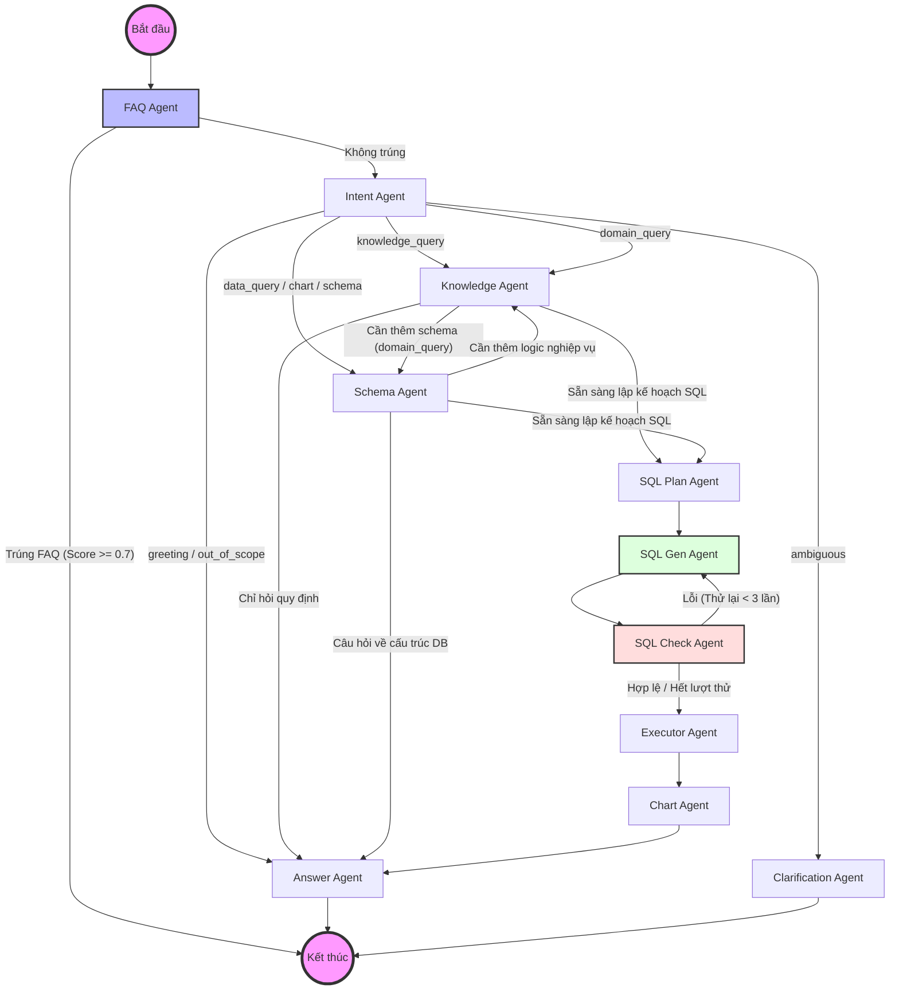

# Tài liệu Kiến trúc Hệ thống NLSQL (Cập nhật)

Tài liệu này mô tả chi tiết kiến trúc Agentic Workflow của hệ thống NLSQL, sử dụng LangGraph để điều phối các AI Agent chuyên biệt.

## 1. Sơ đồ Luồng Hoạt động (Workflow Diagram)

Dưới đây là sơ đồ chi tiết các bước xử lý từ khi người dùng đặt câu hỏi đến khi nhận được câu trả lời cuối cùng.

---

## 2. Mô tả Chi tiết các Agent

### 2.1. FAQ Agent (Cổng ưu tiên)
- **Nhiệm vụ**: Kiểm tra xem câu hỏi có nằm trong bộ FAQ (Frequently Asked Questions) đã được biên soạn sẵn hay không.
- **Công nghệ**: Sử dụng Vector Search (Qdrant) với ngưỡng tương đồng (Threshold) là **0.7**.
- **Kết quả**: Nếu trúng, hệ thống trả về kết quả ngay lập tức (Bypass qua các Agent khác), giúp tốc độ phản hồi cực nhanh.

### 2.2. Intent Agent (Chuyên gia phân tích ý định)
- **Nhiệm vụ**: Phân tích câu hỏi của người dùng để quyết định hướng đi tiếp theo.
- **Các loại ý định**:
    - `data_query`: Truy vấn số liệu từ database.
    - `knowledge_query`: Hỏi về quy định, chính sách, hoặc định nghĩa nghiệp vụ.
    - `domain_query`: Câu hỏi phức tạp cần kết hợp cả database và quy định nghiệp vụ.
    - `ambiguous`: Câu hỏi chưa rõ ràng, cần hỏi lại người dùng.
    - `greeting` / `out_of_scope`: Chào hỏi hoặc câu hỏi ngoài phạm vi.

### 2.3. Knowledge & Schema Agents (Ngữ cảnh nghiệp vụ & Dữ liệu)
- **Knowledge Agent**: Tìm kiếm các quy định nghiệp vụ (Business Rules) trong Qdrant để bổ trợ cho việc viết SQL hoặc trả lời trực tiếp.
- **Schema Agent**: Xác định các bảng và cột dữ liệu liên quan nhất đến câu hỏi.

### 2.4. SQL Gen Pipeline (Plan -> Gen -> Check)
- **SQL Plan Agent**: Lập kế hoạch truy vấn (ví dụ: cần Join bảng nào, Filter điều kiện gì) bằng ngôn ngữ tự nhiên.
- **SQL Gen Agent**: Chuyển kế hoạch thành câu lệnh SQL thực tế (PostgreSQL/ClickHouse).
- **SQL Check Agent**: Kiểm tra lỗi cú pháp và logic. Nếu sai, Agent này sẽ gửi phản hồi kèm lỗi để `SQL Gen Agent` sửa lại (tối đa 3 lần).

---

## 3. Ví dụ Luồng Hoạt động (Input -> Output)

### Ví dụ 1: Luồng FAQ (Fast Track)
- **Người dùng**: "Làm thế nào để đăng ký tài khoản mới?"
- **FAQ Agent**: Tìm thấy câu hỏi tương tự trong kho với Score 0.9.
- **Output**: Trả về câu trả lời đã lưu sẵn: "Để đăng ký tài khoản, bạn vui lòng truy cập..." kèm 3 câu hỏi gợi ý liên quan.
- **Trạng thái**: Kết thúc sớm (Bypass).

### Ví dụ 2: Luồng Truy vấn Dữ liệu (Data Query)
- **Người dùng**: "Top 5 chi nhánh có doanh thu cao nhất tháng 3/2024 là gì?"
- **FAQ Agent**: Không tìm thấy kết quả tương đồng cao.
- **Intent Agent**: Phân loại là `data_query`.
- **Schema Agent**: Xác định bảng `sales`, `branches` và các cột `revenue`, `branch_name`, `sale_date`.
- **Knowledge Agent**: Lấy quy tắc: "Doanh thu = giá bán * số lượng - chiết khấu".
- **SQL Plan Agent**: "Cần Join bảng sales và branches, sum revenue, filter theo tháng 3/2024, group by branch_name, order by desc, limit 5".
- **SQL Gen Agent**: Tạo câu lệnh `SELECT ... FROM ... WHERE ...`.
- **SQL Check Agent**: Kiểm tra cú pháp hợp lệ.
- **Executor Agent**: Chạy SQL trên DB và lấy về danh sách 5 chi nhánh.
- **Answer Agent**: "Dưới đây là top 5 chi nhánh có doanh thu cao nhất..." kèm bảng dữ liệu hoặc biểu đồ.

### Ví dụ 3: Luồng Quy định (Knowledge Query)
- **Người dùng**: "Chính sách hoa hồng cho đại lý cấp 1 là bao nhiêu?"
- **Intent Agent**: Phân loại là `knowledge_query`.
- **Knowledge Agent**: Tìm kiếm trong tài liệu nghiệp vụ và thấy đoạn: "Đại lý cấp 1 có tỷ lệ hoa hồng là 15% trên tổng giá trị đơn hàng..."
- **Answer Agent**: Tổng hợp và trả lời trực tiếp cho người dùng dựa trên thông tin tìm được.

---

## 4. Quản lý Trạng thái (State Management)

Hệ thống sử dụng `AgentState` để truyền thông tin giữa các Agent:
- `user_query`: Câu hỏi gốc của người dùng.
- `intent`: Ý định đã được phân loại.
- `sql`: Câu lệnh SQL đã được tạo.
- `data_result`: Dữ liệu thô từ database.
- `history`: Lịch sử trò chuyện để giữ ngữ cảnh.
- `retry_count`: Đếm số lần thử lại khi tạo SQL lỗi.

---
*Tài liệu này được cập nhật tự động để phản ánh kiến trúc Agentic đa tầng của NLSQL.*