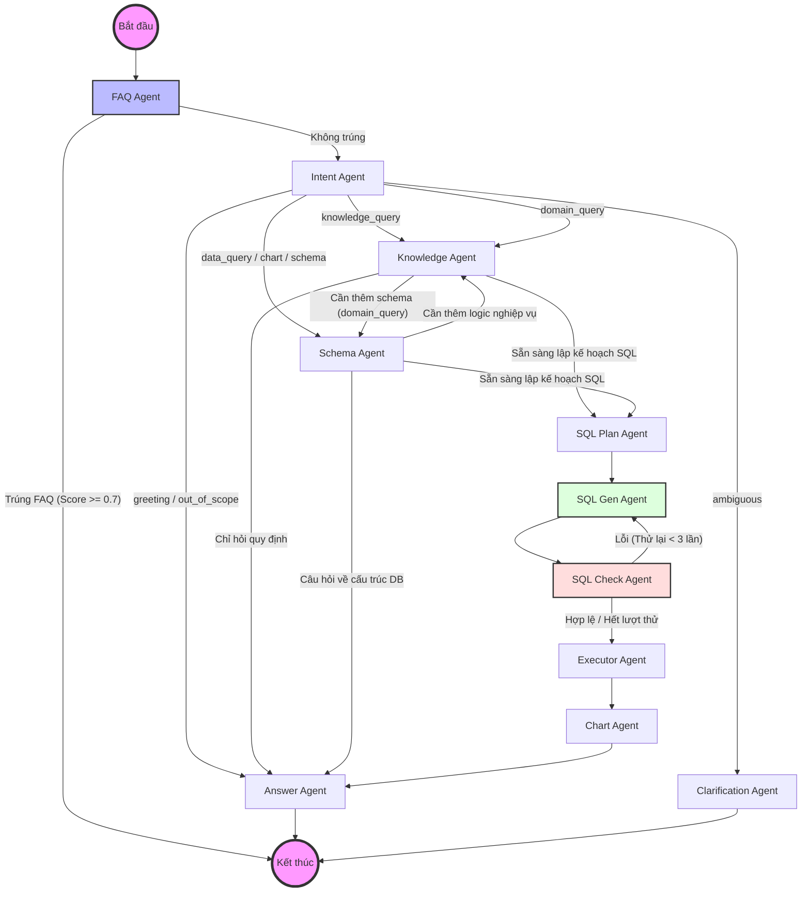

# Tài liệu Kiến trúc Hệ thống NLSQL (Cập nhật)

Tài liệu này mô tả chi tiết kiến trúc Agentic Workflow của hệ thống NLSQL, sử dụng LangGraph để điều phối các AI Agent chuyên biệt.

## 1. Sơ đồ Luồng Hoạt động (Workflow Diagram)

Dưới đây là sơ đồ chi tiết các bước xử lý từ khi người dùng đặt câu hỏi đến khi nhận được câu trả lời cuối cùng.

---

## 2. Mô tả Chi tiết xử lý tại các Agent (Node)

Quá trình điều phối luồng xử lý do hệ thống LangGraph đảm nhận. Tại mỗi node (tương ứng một Agent), hệ thống sẽ nhận đầu vào là trạng thái chung (`AgentState`), thực hiện các thao tác chuyên biệt và trả về các thay đổi (delta) để cập nhật vào State rồi chuyển cho node tiếp theo. Dưới đây là chi tiết công việc tại từng node:

### 2.1. FAQ Agent (faq_agent)
- **Đầu vào chính**: `user_query`.
- **Nhiệm vụ**: Tìm kiếm câu trả lời nhanh từ cơ sở dữ liệu các câu hỏi thường gặp (Qdrant semantic search). 
- **Kết quả / Cập nhật**: 
  - Nếu kết quả tìm kiếm có độ tương đồng `> 0.7`: cập nhật `intent` thành `faq_answered`, gắn câu trả lời vào `answer`, lưu vào danh sách `recommend_questions`. Graph sẽ **Bypass** thẳng đến khối hoàn tất (END).
  - Nếu không trúng: Không thay đổi state và truyền thẳng sang `intent_agent`.

### 2.2. Intent Agent (intent_agent)
- **Đầu vào chính**: `user_query`, `history`.
- **Nhiệm vụ**: Gọi LLM (OpenAI) để phân loại ý định cốt lõi của người dùng để định tuyến.
- **Kết quả / Cập nhật**:
  - Gán `intent` thuộc 1 trong các nhóm: `data_query`, `chart_request`, `schema_question`, `knowledge_query`, `domain_query`, `ambiguous`, `greeting`, `out_of_scope`.
  - Nếu `intent` là `ambiguous` (không rõ ràng), sinh thêm câu hỏi và gán vào `clarification_question`.

### 2.3. Schema Agent (schema_agent)
- **Đầu vào chính**: `user_query`, `selected_tables` (tùy chọn theo context).
- **Nhiệm vụ**: Dùng Vector Search (trên các index schema của bảng) để tìm ra các bảng phục vụ truy vấn. Nếu tìm được < 2 bảng, dùng thêm LLM Fallback quét danh sách full table.
- **Kết quả / Cập nhật**: Trả về `relevant_tables` (danh sách tên bảng) và `schema_context` (chứa siêu dữ liệu bảng như mô tả, foreign keys, columns data type và mẫu data 3 dòng).

### 2.4. Knowledge Agent (knowledge_agent)
- **Đầu vào chính**: `user_query`.
- **Nhiệm vụ**: Vector search bóc tách các quy định, công thức tính toán hoặc rule đặc thù của doanh nghiệp đối với domain hiện tại.
- **Kết quả / Cập nhật**: Gán kết quả tìm được vào `knowledge_context`. Dữ liệu này dùng để nối vào hệ thống prompt sinh SQL sau này.

### 2.5. SQL Plan Agent (sql_plan_agent)
- **Đầu vào chính**: `user_query`, `schema_context`, `knowledge_context`.
- **Nhiệm vụ**: "Think step-by-step". LLM lên một phác thảo thuật toán tư duy viết SQL tự nhiên: cần chọn gì, join bảng nào, lọc điều kiện gì.
- **Kết quả / Cập nhật**: Gán vào trường `query_plan`.

### 2.6. SQL Gen Agent (sql_gen_agent)
- **Đầu vào chính**: `query_plan`, `schema_context`, phản hồi sửa lỗi `sql_correction` (nếu đang trong vòng lặp retry).
- **Nhiệm vụ**: Translate các kế hoạch và quy định thành câu lệnh SQL Postgres/ClickHouse chuẩn xác.
- **Kết quả / Cập nhật**: Gán nội dung vào `generated_sql`, dự kiến `final_sql` ban đầu, và `sql_reasoning` (giải thích cho việc dùng câu SQL này).

### 2.7. SQL Check Agent (sql_check_agent)
- **Đầu vào chính**: `generated_sql`.
- **Nhiệm vụ**: Kiểm thử tính tương thích (cú pháp, các bảng hoặc hàm tồn tại).
- **Kết quả / Cập nhật**: Gán vào `sql_correction` (`is_valid`, `issues`). Nếu `is_valid` = False, luồng Node tự động chuyển sang Node `inc_retry` (để tăng `retry_count`) và lặp lại Node `sql_gen` (giới hạn 3 lần thử lại).

### 2.8. Executor Agent (executor_agent)
- **Đầu vào chính**: `final_sql`.
- **Nhiệm vụ**: Thực thi an toàn câu truy vấn trên SQL Engine.
- **Kết quả / Cập nhật**: Gán bảng kết quả dạng JSON vào `query_result`, số lượng bản ghi vào `row_count`, cũng như `execution_time_ms` tính toán. Nếu lỗi, lưu chi tiết vào `executor_error`.

### 2.9. Chart Agent (chart_agent)
- **Đầu vào chính**: `query_result`, `intent`.
- **Nhiệm vụ**: Nếu Intent yêu cầu sinh biểu đồ hoặc dữ liệu phù hợp để visualize, Agent gợi ý cấu hình biểu đồ (Line, Bar, Pie...) và format trục tọa độ.
- **Kết quả / Cập nhật**: Tạo và lưu object render vào `chart_config` và `chart_data`.

### 2.10. Answer & Clarification Agents
- **Nhiệm vụ**: Trả về dữ liệu đóng gói cuối cùng. `answer_agent` đóng văn bản trả lời dựa vào Result hoặc Fallback error. `clarification_agent` hỏi ngược lại nếu intent thiếu.

---

## 3. Ví dụ Luồng Hoạt động (Input -> Output)

### Ví dụ 1: Luồng FAQ (Fast Track)
- **Người dùng**: "Làm thế nào để đăng ký tài khoản mới?"
- **FAQ Agent**: Tìm thấy câu hỏi tương tự trong kho với Score 0.9.
- **Output**: Trả về câu trả lời đã lưu sẵn: "Để đăng ký tài khoản, bạn vui lòng truy cập..." kèm 3 câu hỏi gợi ý liên quan.
- **Trạng thái**: Kết thúc sớm (Bypass).

### Ví dụ 2: Luồng Truy vấn Dữ liệu (Data Query)
- **Người dùng**: "Top 5 chi nhánh có doanh thu cao nhất tháng 3/2024 là gì?"
- **FAQ Agent**: Không tìm thấy kết quả tương đồng cao.
- **Intent Agent**: Phân loại là `data_query`.
- **Schema Agent**: Xác định bảng `sales`, `branches` và các cột `revenue`, `branch_name`, `sale_date`.
- **Knowledge Agent**: Lấy quy tắc: "Doanh thu = giá bán * số lượng - chiết khấu".
- **SQL Plan Agent**: "Cần Join bảng sales và branches, sum revenue, filter theo tháng 3/2024, group by branch_name, order by desc, limit 5".
- **SQL Gen Agent**: Tạo câu lệnh `SELECT ... FROM ... WHERE ...`.
- **SQL Check Agent**: Kiểm tra cú pháp hợp lệ.
- **Executor Agent**: Chạy SQL trên DB và lấy về danh sách 5 chi nhánh.
- **Answer Agent**: "Dưới đây là top 5 chi nhánh có doanh thu cao nhất..." kèm bảng dữ liệu hoặc biểu đồ.

### Ví dụ 3: Luồng Quy định (Knowledge Query)
- **Người dùng**: "Chính sách hoa hồng cho đại lý cấp 1 là bao nhiêu?"
- **Intent Agent**: Phân loại là `knowledge_query`.
- **Knowledge Agent**: Tìm kiếm trong tài liệu nghiệp vụ và thấy đoạn: "Đại lý cấp 1 có tỷ lệ hoa hồng là 15% trên tổng giá trị đơn hàng..."
- **Answer Agent**: Tổng hợp và trả lời trực tiếp cho người dùng dựa trên thông tin tìm được.

---

## 4. Quản lý Trạng thái Khối Dữ liệu (State Management)

Hệ thống sử dụng một lớp `TypedDict` có tên là `AgentState` được truyền đi xuyên suốt chu trình sống của Graph, đảm nhận vai trò bộ nhớ tập trung mô tả chi tiết trạng thái của mỗi phiên hỏi đáp. Các node trong LangGraph sau khi tiếp nhận State sẽ tiến hành chỉnh sửa nội dung State (delta updates).

**Cấu trúc dữ liệu chính trong AgentState**:

- **Thông tin Phiên & Nhận dạng Ngữ cảnh đầu vào**:
  - `user_query`: Câu hỏi gốc của người dùng.
  - `session_id`: ID định danh phiên chat hiện tại.
  - `history`: Lịch sử các trao đổi trước đó (dạng mảng object messages) để bảo toàn mạch giao tiếp.

- **Định tuyến Intent**:
  - `intent`: Các luồng xử lý do LLM phân luồng (data, schema, knowledge, chart_request, etc).
  - `clarification_question`: Câu hỏi hỏi lại người dùng để chốt yêu cầu nếu có sự mập mờ (ambiguous).

- **Trích xuất Ngữ cảnh (Retrieval Context)**:
  - `relevant_tables` & `schema_context`: Danh sách bảng và metadata tường minh của cấu trúc các bảng. Nó bao gồm foreign keys (chuyên dành cho Postgres), sample_row, column definition giúp việc sinh SQL chính xác.
  - `knowledge_context`: Ngữ cảnh dữ liệu dạng văn bản từ hệ thống RAG dùng làm "Business Rule" bù trừ cho việc sinh SQL khi công thức phức tạp xuất hiện trong `domain_query`.

- **Quy trình Sinh SQL & Check Valid**:
  - `query_plan`: Suy luận ngôn ngữ con người về cách viết SQL.
  - `generated_sql` & `sql_reasoning`: Lệnh SQL thô và giải thích.
  - `sql_correction`: Danh sách cờ flag (`is_valid`) và messages lỗi được trả lại khi validator check failed.
  - `retry_count`: Số lần loop lại node `sql_gen` (Max = 3).
  - `final_sql`: Sql quyết định cuối cùng được chuyển xuống tầng xử lý máy chủ dưới DB sâu hơn.

- **Thực thi và Đóng gói (Execution & Response)**:
  - `query_result`: Array JSON records lấy nguyên mẫu từ Database (Postgres/ClickHouse).
  - `execution_time_ms`, `row_count`: Trích xuất độ trễ và khối lượng data trả về.
  - `chart_config` & `chart_data`: Các flag và thông số tọa độ biểu đồ khi giao diện cần render dashboard visualize dữ liệu cho người dùng.
  - `answer` & `answer_format`: Đoạn văn bản hoàn chỉnh và thẻ format (ví dụ text, table, chart+text) để Frontend parse và hiển thị.
  - `recommend_questions`: Danh sách gợi ý câu hỏi tiếp theo cho tính năng FAQ Auto-suggest.

---
*Tài liệu này được cập nhật tự động để phản ánh kiến trúc Agentic đa tầng của NLSQL.*

