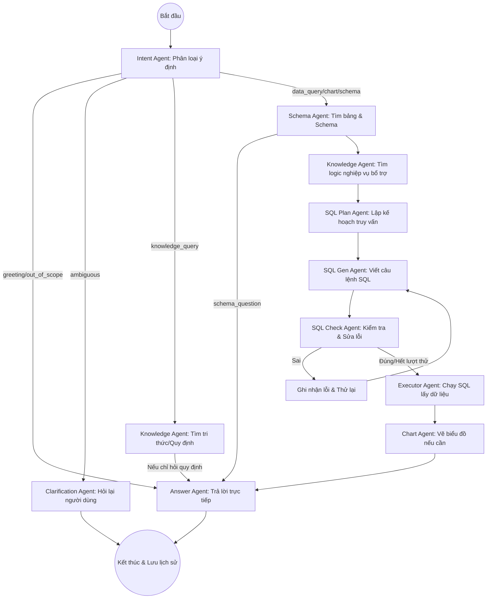

Tôi đã kiểm tra lại toàn bộ mã nguồn của hệ thống NLSQL và tổng hợp lại luồng hỏi đáp (QA Flow) hiện tại. Hệ thống đang vận hành theo kiến trúc **LangGraph (Multi-Agent)**, cho phép xử lý linh hoạt tùy theo ý định của người dùng.

Dưới đây là mô tả chi tiết:

### 1. Sơ đồ luồng tổng quát (Workflow Diagram)

---

### 2. Chi tiết các bước xử lý

#### Bước 1: Tiếp nhận và Phân loại (Entry & Intent)
- **API**: Nhận yêu cầu tại `/api/v1/chat`.
- **Intent Agent**: Phân tích câu hỏi và lịch sử hội thoại để xác định 1 trong các loại: `data_query` (hỏi số liệu), `knowledge_query` (hỏi quy định), `chart_request` (vẽ biểu đồ), `schema_question` (hỏi về cấu trúc DB), `ambiguous` (mơ hồ),...

#### Bước 2: Chuẩn bị ngữ cảnh (Schema & Knowledge)
- **Schema Agent**: Tìm kiếm các bảng liên quan trong Qdrant. Nếu tìm không thấy bằng vector search, nó sẽ dùng LLM để đoán các bảng phù hợp từ danh sách tất cả các bảng.
- **Knowledge Agent**: Đây là bước chúng ta vừa tối ưu. Nó tìm kiếm trong kho tri thức các quy tắc liên quan (ví dụ: định nghĩa "Sinh viên xuất sắc"). 
    - Kết quả trả về gồm văn bản thuần cho người dùng và **Business Context** (JSON) cho các bước tiếp theo.

#### Bước 3: Lập kế hoạch và Sinh SQL (Planning & Generation)
- **SQL Plan Agent**: (Đã được kích hoạt) Sử dụng Schema và Tri thức nghiệp vụ để viết ra một bản kế hoạch logic (VD: Join bảng A với B, lọc theo điều kiện C).
- **SQL Gen Agent**: Chuyển bản kế hoạch thành câu lệnh SQL PostgreSQL thực tế. Agent này có sử dụng thêm **Few-shot examples** (các ví dụ mẫu) từ Qdrant để đảm bảo cú pháp chuẩn.

#### Bước 4: Kiểm tra và Thực thi (Validation & Execution)
- **SQL Check Agent**: Kiểm tra xem câu lệnh SQL có lỗi cú pháp không, có đúng yêu cầu không. Nếu sai, nó yêu cầu `sql_gen` sửa lại (tối đa 3 lần).
- **Executor Agent**: Chạy câu lệnh SQL cuối cùng lên database (PostgreSQL hoặc ClickHouse tùy cấu hình) để lấy dữ liệu thực.

#### Bước 5: Trực quan hóa và Trả lời (Visualization & Answer)
- **Chart Agent**: Nếu người dùng yêu cầu biểu đồ hoặc dữ liệu phù hợp để vẽ biểu đồ, nó sẽ sinh cấu hình `chart_config`.
- **Answer Agent**: Tổng hợp tất cả: Dữ liệu từ DB + Tri thức từ Knowledge Base + Biểu đồ để tạo ra câu trả lời tự nhiên nhất cho người dùng.

---

### 3. Những điểm nổi bật (Key Features)
1.  **Đồng bộ Tri thức Nghiệp vụ**: Hệ thống không chỉ nhìn vào Database mà còn "đọc" cả các quy định bạn đã nhập để hiểu các khái niệm ngầm định.
2.  **Khả năng Tự sửa lỗi**: Luồng `SQL Gen <-> SQL Check` giúp giảm thiểu tối đa các lỗi cú pháp SQL trước khi gửi đến Database.
3.  **Lưu trữ Hội thoại**: Toàn bộ luồng được gắn với một `session_id`, dữ liệu được lưu vào Postgres giúp chatbot nhớ được ngữ cảnh của các câu hỏi trước đó.

Bạn thấy luồng xử lý này đã đáp ứng đúng kỳ vọng của bạn chưa, hay cần điều chỉnh thêm ở mắt xích nào không?