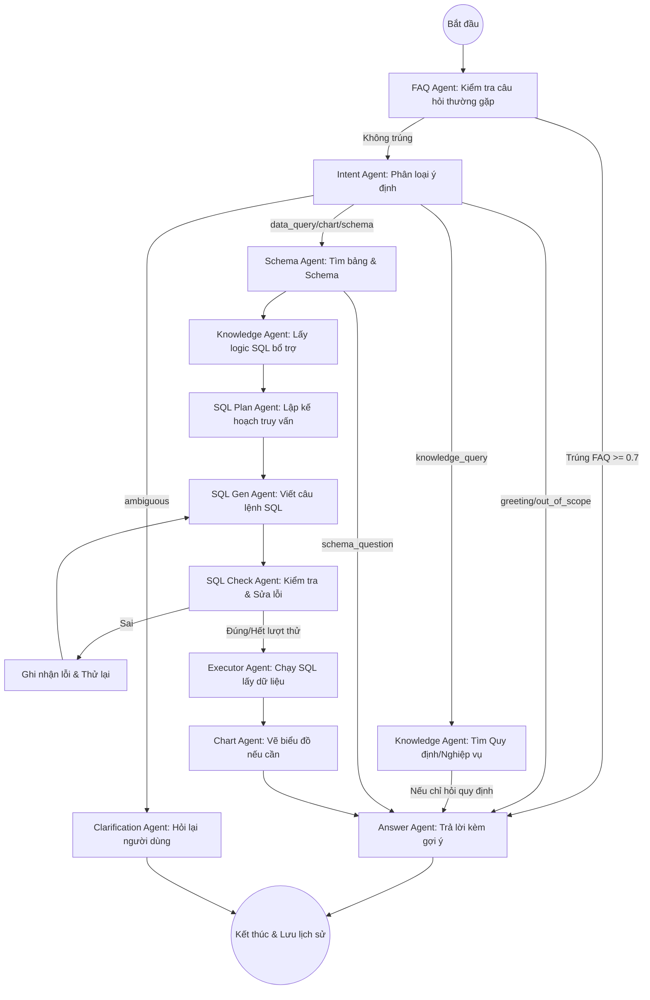

Tôi đã cập nhật lại kiến trúc hệ thống NLSQL để phản chiếu các tính năng mới nhất về **FAQ (Fast Track)**, **Cơ sở dữ liệu nội bộ (Internal DB)** và luồng xử lý Agent tối ưu.

### 1. Sơ đồ luồng xử lý LangGraph (Workflow Diagram)

---

### 2. Chi tiết các thành phần mới

#### A. FAQ Agent (Fast-Track Flow)
Đây là "người gác cổng" mới của hệ thống:
- **Cơ chế**: Sử dụng Vector Search (Qdrant `faq_collection`) để so khớp câu hỏi người dùng với kho câu hỏi thường gặp.
- **Hiệu năng**: Nếu độ tương quan semantic >= **0.7**, hệ thống trả lời ngay lập tức (Bypass qua toàn bộ luồng LLM phía sau), giúp tốc độ phản hồi cực nhanh (< 1s).
- **Gợi ý**: Tự động đề xuất 3 câu hỏi FAQ liên quan nhất để người dùng tiếp tục tương tác.

#### B. Cơ sở dữ liệu nội bộ (Internal Database - PostgreSQL)
Hệ thống hiện tại sử dụng mô hình Database kép:
1. **Analytical DB**: ClickHouse / PostgreSQL bên ngoài (Chỉ đọc) để truy vấn số liệu nghiệp vụ.
2. **Internal Management DB**: PostgreSQL riêng (Port 8389) dùng để quản lý:
    - **Quy định nghiệp vụ (Business Rules)**: Định nghĩa các khái niệm logic cho AI.
    - **FAQ**: Kho câu hỏi và trả lời sẵn có.
    - **Lịch sử chat & Checkpoints**: Lưu trạng thái phiên làm việc của LangGraph.
- **Quản lý**: Sử dụng **Alembic** để bảo trì và nâng cấp cấu trúc bảng (Migrations).

#### C. Lập kế hoạch SQL thông minh (SQL Planning)
- **SQL Plan Agent**: Thay vì viết SQL ngay, Agent này phân tích Schema + Quy định nghiệp vụ để tạo ra "Bản thiết kế truy vấn" (Query Plan) bằng ngôn ngữ tự nhiên, giúp giảm thiểu sai sót logic khi Join nhiều bảng phức tạp.

---

### 3. Các tính năng nổi bật (Key Capabilities)

1. **Định nghĩa Logic động (Business Context)**: Bạn có thể thêm quy định "Doanh thu thuần = Doanh thu - Chiết khấu" vào hệ thống qua API/UI, AI sẽ tự động áp dụng công thức này vào mọi câu lệnh SQL sau đó.
2. **Tùy chọn Nguồn dữ liệu (Data Source Selection)**: Người dùng có thể chọn phạm vi dữ liệu trực tiếp trên giao diện (Toàn bộ / Đào tạo / Nhân sự) để định hướng API tìm kiếm chính xác hơn.
3. **Cơ chế Retry & Check**: Luồng `SQL Gen <-> SQL Check` tự động sửa lỗi cú pháp đến 3 lần trước khi thực thi, đảm bảo tỷ lệ thành công cao cho các câu lệnh phức tạp.
4. **Tích hợp Qdrant (Hybrid Search)**: Kết hợp giữa tìm kiếm Vector (cho FAQ/Knowledge) và tìm kiếm Metadata (cho Schema) để cung cấp ngữ cảnh đầy đủ nhất cho LLM.

---
*Tài liệu này được cập nhật theo phiên bản tích hợp FAQ Agent và Internal DB Version Control.*